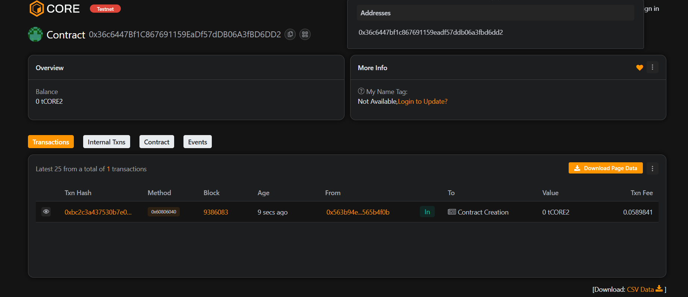

# 💎 VaultLogic

## 📘 Project Description
**VaultLogic** is a decentralized Ethereum-based vault system that allows users to securely deposit, withdraw, and manage their digital assets without any intermediaries. It ensures transparency and complete ownership of funds.

---

## 🌍 Project Vision
To create a **fully trustless and secure blockchain-based vault** where users can safely store and manage their crypto assets with full control and auditability.

---

## ✨ Key Features
- 💰 **Secure Deposits & Withdrawals** — Manage your ETH safely within the vault.  
- 🔐 **Owner-Only Control** — Only the vault owner can change ownership.  
- 🌐 **Transparency** — Balances and transactions visible on-chain.  
- ⚡ **Fast Execution** — Built with optimized Solidity functions.

---

## 🚀 Future Scope
- 🪙 Integrate ERC20 token vault support.  
- 🔄 Implement multi-signature authentication.  
- 📊 Build a dashboard for vault analytics.  
- 🧩 Add DAO-based access control for group vaults.  

---

## 🧩 Tech Stack
- **Solidity** for Smart Contract Development  
- **Hardhat** for Testing & Deployment  
- **JavaScript** for Deployment Scripts  
- **Ethereum / Sepolia Testnet** for On-chain Execution  

---

**Developed by:** _Your Name_  
**Version:** 1.0.0  

Contract add :  0x36c6447Bf1C867691159EaDf57dDB06A3fBD6DD2
